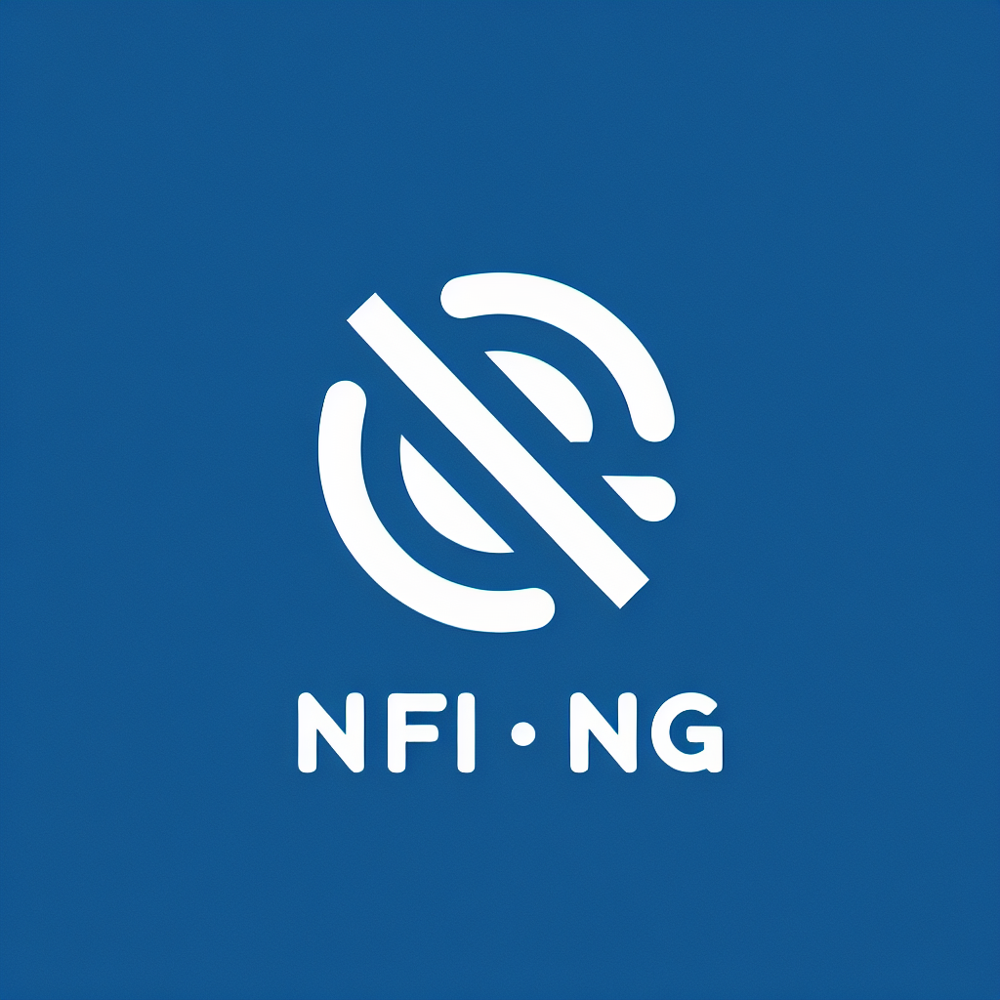
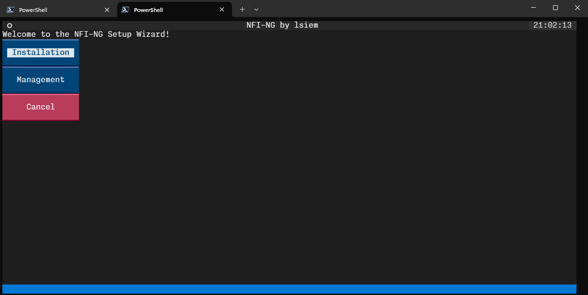
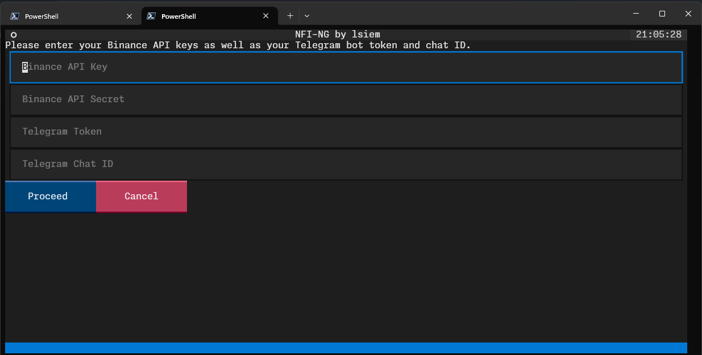
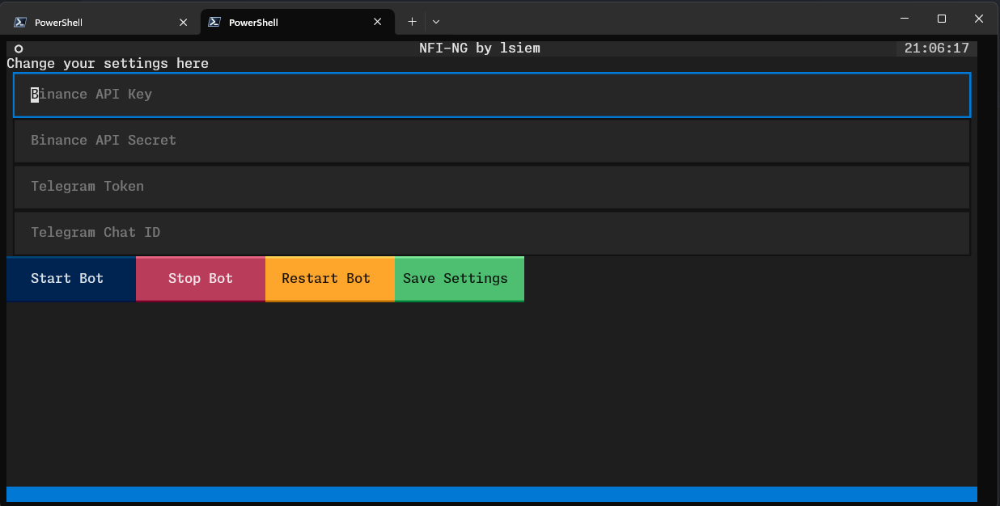

<p align="center">
  
</p>
<p align="center">
    <h1 align="center">NFI-NG</h1>
</p>
<p align="center">
    <em>Automate Trading with Ease!<br>All In One Management Tool for freqtrade with NostalgiaForInfinityX strategy</em>
</p>
<p align="center">
	
	
	
	
<p>
<p align="center">
	<!-- default option, no dependency badges. -->
</p>

<br><!-- TABLE OF CONTENTS -->
<details>
  <summary>Table of Contents</summary><br>

- [ Overview](#-overview)
- [ Features](#-features)
- [ Repository Structure](#-repository-structure)
- [ Modules](#-modules)
- [ Getting Started](#-getting-started)
  - [ Installation](#-installation)
  - [ Usage](#-usage)
  - [ Tests](#-tests)
- [ Project Roadmap](#-project-roadmap)
- [ Contributing](#-contributing)
- [ License](#-license)
- [ Acknowledgments](#-acknowledgments)
</details>
<hr>

##  Overview

NFI-NG is an all-encompassing tool designed to facilitate the establishment of a solid Freqtrade environment utilizing the NostalgiaForInfinityX strategy. It boasts a suite of features such as assisted installation, configuration management, and automated updates. Moreover, NFI-NG delivers a user-friendly terminal interface for bot and configuration management, and streamlines updates with Telegram notifications, enabling newcomers to effortlessly set up and oversee their requirements without delving into Freqtrade documentation or editing configuration files manually.

---


## Gallery

<p align="center">
	
	
	
</p>

<br>

---

##  Features

| **Feature** | **Description** |
| --- | --- |
| ⚙️ Architecture | The project's architecture enables setting up a Docker container for Freqtrade, configuring it to run the NFIX strategy, store data, and log progress. |
| 📄 Documentation | Additional documentation for clarity on certain features is in progress. |
| 🔌 Integrations | Integrations include textual and requests for automated bot management and configuration settings. |
| 🤖 Scripting | Scripts available in the repository are: `bot_management_gui.py` - creates a GUI for managing bot configurations, `install_docker.py` - handles OS-agnostic Docker installation processes, `auto_update.py` - automates strategy updates and sends Telegram notifications, `tui_setup_wizard.py` - setup wizard for orchestrating NFI-NG's installation process. |
| 🔧 Docker | Docker containers are utilized in the project setup to enable configuration of the NFIX strategy, storage of data, and logging progress. |
| 👥 Telegram | The project integrates with Telegram for sending notifications related to strategy updates. |
| 💻 Setup Wizard | The setup wizard script guides users through the installation process by prompting them for necessary API keys, tokens, and chat IDs. |


##  Getting Started

**System Requirements:**

* **Python**: `Tested on 3.12`

###  Installation and usage

<h4>Automated</h4>

> 1. Linux:
> ```console
> $ curl -fsSL https://raw.githubusercontent.com/lsiem/NFI-NG/master/setup.sh | sh
> ```
>
> 2. Windows
> ```console
> $ Invoke-WebRequest -Uri "https://raw.githubusercontent.com/lsiem/NFI-NG/main/setup.ps1" -OutFile "setup.ps1"; .\setup.ps1
> ```

###  Usage

<h4>Not implemented yet! Use Automated script</h4>

> Run NFI-NG using the command below:
> ```console
> $ > NFI-NG start
> ```

---

##  Project Roadmap

- [X] `► Initial alpha release with all the essential features`
- [ ] `► Improve code documentation and overall structure`
- [ ] `► Improving the user interface`
- [ ] `► Add more configurable options for installation`
- [ ] `► Better bot management by providing a WebUI with logs, current configuration, profit and so on...`


##  Contributing

Contributions are welcome! Here are several ways you can contribute:

- **[Report Issues](https://github.com/lsiem/NFI-NG/issues)**: Submit bugs found or log feature requests for the `NFI-NG` project.
- **[Submit Pull Requests](https://github.com/lsiem/NFI-NG/blob/main/CONTRIBUTING.md)**: Review open PRs, and submit your own PRs.
- **[Join the Discussions](https://github.com/lsiem/NFI-NG/discussions)**: Share your insights, provide feedback, or ask questions.

<details closed>
<summary>Contributing Guidelines</summary>

1. **Fork the Repository**: Start by forking the project repository to your github account.
2. **Clone Locally**: Clone the forked repository to your local machine using a git client.
   ```sh
   git clone https://github.com/lsiem/NFI-NG
   ```
3. **Create a New Branch**: Always work on a new branch, giving it a descriptive name.
   ```sh
   git checkout -b new-feature-x
   ```
4. **Make Your Changes**: Develop and test your changes locally.
5. **Commit Your Changes**: Commit with a clear message describing your updates.
   ```sh
   git commit -m 'Implemented new feature x.'
   ```
6. **Push to github**: Push the changes to your forked repository.
   ```sh
   git push origin new-feature-x
   ```
7. **Submit a Pull Request**: Create a PR against the original project repository. Clearly describe the changes and their motivations.
8. **Review**: Once your PR is reviewed and approved, it will be merged into the main branch. Congratulations on your contribution!
</details>

<details closed>
<summary>Contributor Graph</summary>
<br>
<p align="center">
   <a href="https://github.com{/lsiem/NFI-NG/}graphs/contributors">
      
   </a>
</p>
</details>

---

##  License

Details about the license can be found here: [LICENSE](https://choosealicense.com/licenses/).

---

##  Acknowledgments

- freqtrade for providing the actual crypto bot (https://www.freqtrade.io/en/stable/)
- iterativv for providing the trading strategy (https://github.com/iterativv/NostalgiaForInfinity)

[**Return**](#-overview)

---
